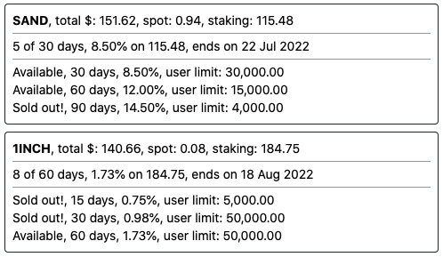

# Crypto Tools

## Binance Staking Overview

Web app that provides an overview of your spot wallet balances as well as your
locked staking positions. It will also display the available or sold out locked
staking products for each of your assets.

## Getting Started

### Online

* https://crypto-tools.andstuff.club

### Local Installation

1. Install Node.js
2. Clone or download this repository
3. Rename `.env.development.local.example` to `.env.development.local`
4. Create an API key in your Binance account and copy paste the values in the
   file above
5. Using the terminal, run `npm install` and then `npm run dev` inside the
   downloaded folder
6. Open [http://localhost:3000/](http://localhost:3000/)

## TODO

* Remove decimals when displaying the "user quota reached" message
* Remember me
* Regroup assets with no staking products
* Regroup products with no positions
