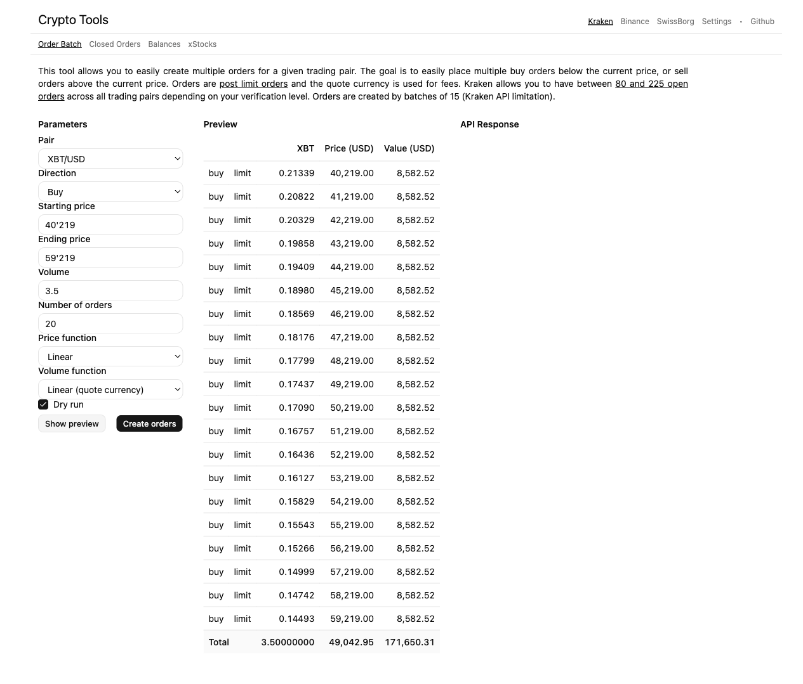
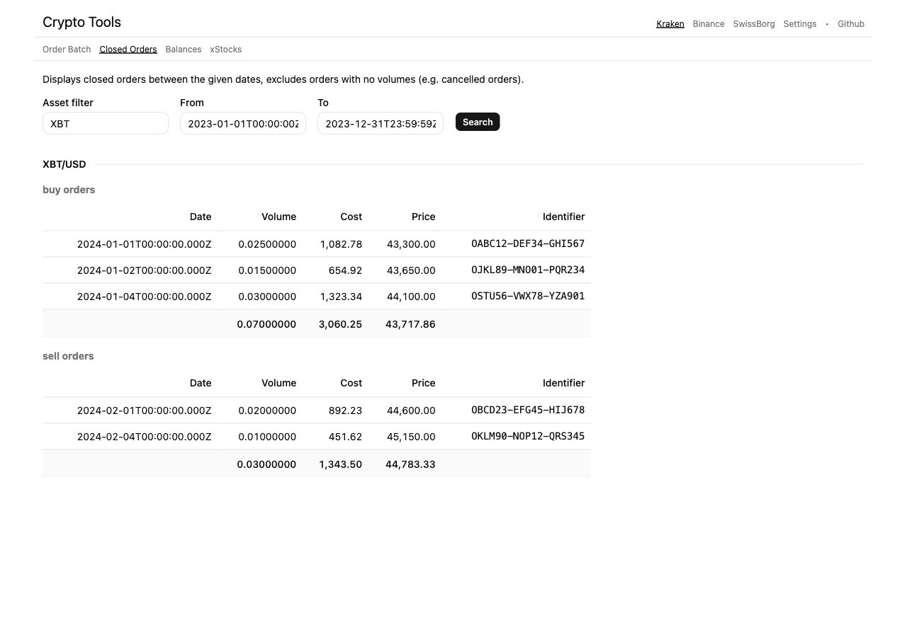
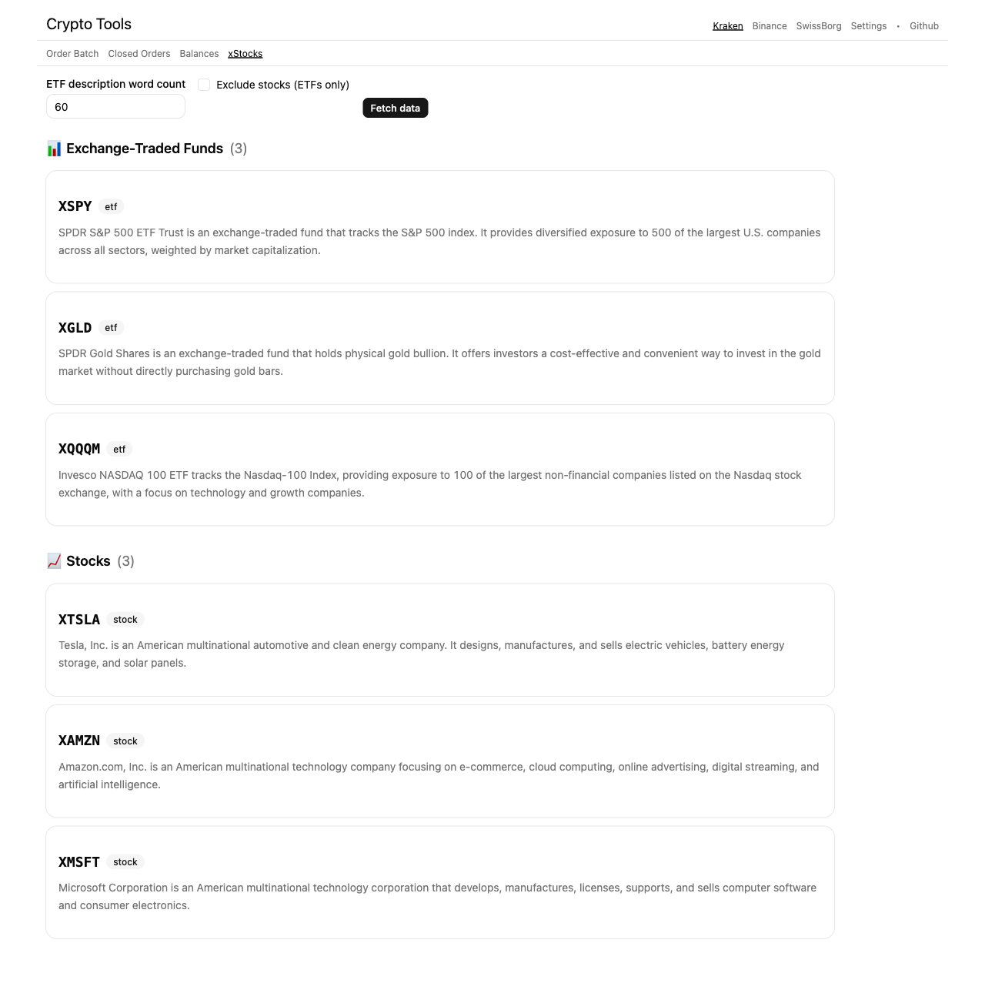
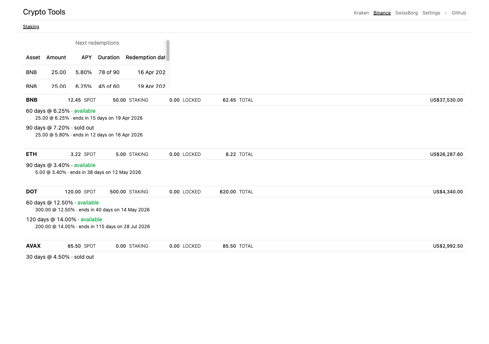
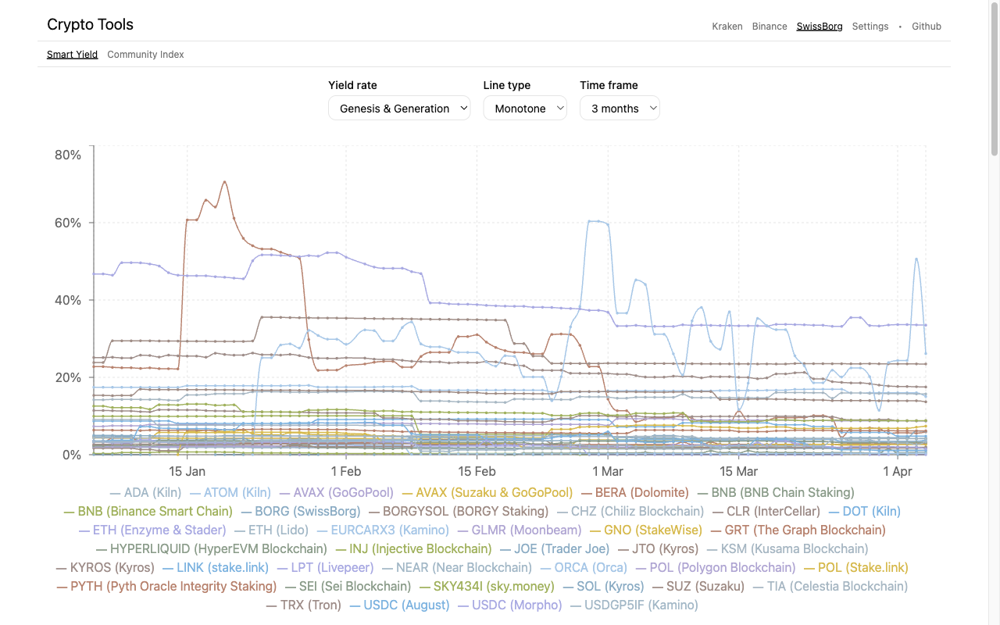

# Crypto Tools

A collection of cryptocurrency tools for [Kraken](https://www.kraken.com/), [Binance](https://www.binance.com/), and [SwissBorg](https://swissborg.com/) exchanges. Built with Next.js, React, and Tailwind CSS.

> **Live version**: https://crypto-tools.andstuff.dev

## Features

### Kraken

- **Order Batch** — Create multiple buy or sell post-limit orders for a trading pair with configurable price and volume distribution functions. Supports dry-run mode for safe testing.
- **Closed Orders** — View and filter closed orders by asset and date range. Displays buy and sell orders grouped by trading pair with volume, cost, and average price summaries.
- **Balances** — View spot and staking account balances.
- **xStocks** — AI-powered classification of Kraken tokenized assets (stocks and ETFs) using Anthropic Claude. Generates descriptions with configurable word count and supports filtering by asset type.







### Binance

- **Staking Overview** — Overview of spot wallet balances and locked staking positions, including available and sold-out staking products for each asset. Shows next redemptions sorted by date, per-asset breakdowns with fiat valuations, and staking product details with quota analysis.



### SwissBorg

- **Smart Yield** — Interactive chart of SwissBorg Smart Yield rates over time with configurable yield rate types, line types, and time frames. Toggle individual yield lines via the chart legend — hidden yields are also removed from the averages table below.
- **Community Index** — Historical chart of the SwissBorg Community Index score.



## Installation

1. Install [Node.js](https://nodejs.org/) and [pnpm](https://pnpm.io/)
2. Clone the repository
   ```sh
   git clone https://github.com/nyg/crypto-tools.git
   cd crypto-tools
   ```
3. Install dependencies
   ```sh
   pnpm install
   ```
4. (Optional) Copy `.env.development.local.example` to `.env.development.local` and fill in your API keys
5. Start the development server
   ```sh
   pnpm dev
   ```
6. Open http://localhost:3000

### Mocked Mode

Run the app with mock data (no API keys or database required):

```sh
pnpm mocked
```

This sets `NEXT_PUBLIC_MOCK_DATA=true`, which intercepts all API calls with a mock fetcher and auto-initializes `localStorage` with fake credentials. Useful for development and demos.

## Usage

Navigate via the top menu bar to access each exchange's tools. Each exchange section has sub-navigation for its specific features.

API keys for Kraken, Binance, and Anthropic can be configured on the **Settings** page (stored in `localStorage`) or via environment variables.

## Project Structure

```
pages/                  File-based routing (Next.js Pages Router)
├── api/                Server-side API routes
│   ├── binance/        Binance API proxy routes
│   ├── kraken/         Kraken API proxy routes
│   └── swissborg/      SwissBorg API & cron routes
├── binance/            Binance pages
├── kraken/             Kraken pages
├── swissborg/          SwissBorg pages
└── settings.js         API key management
components/             React components
├── binance/            Binance-specific components
├── kraken/             Kraken-specific components
├── swissborg/          SwissBorg-specific components
├── lib/                Custom wrapper components
└── ui/                 shadcn/ui primitives
lib/
├── adapters/           External API adapters (Binance, Kraken, Anthropic)
│   └── http-requester/ HTTP transport abstraction (got for server, fetch for browser)
└── services/           Business logic (rate finder using Dijkstra's algorithm)
utils/                  Utility functions (crypto, formatting, event bus)
```

## Disclaimer

Use at your own risk.

## License

[MIT](LICENSE)
