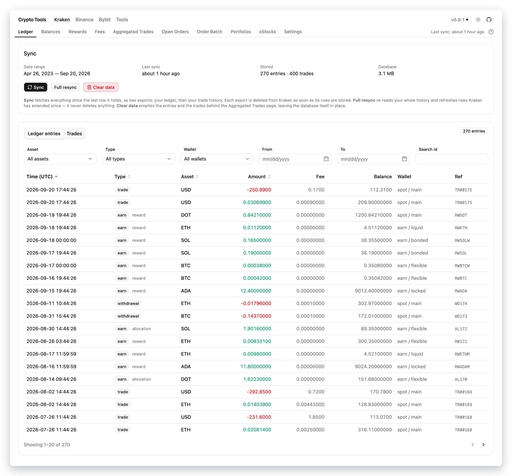
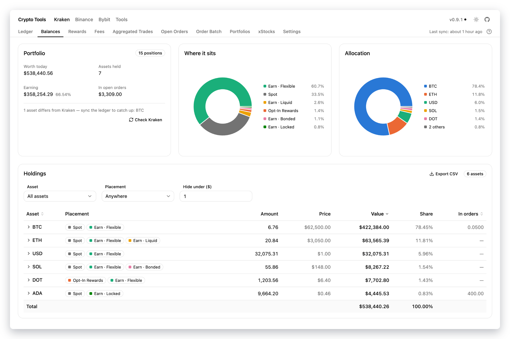
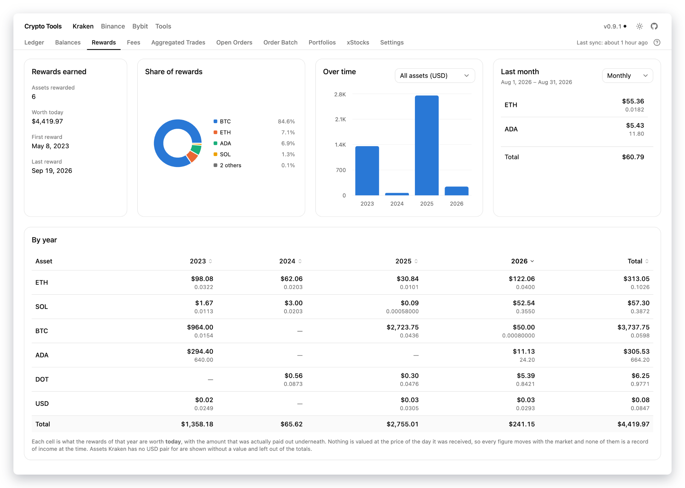
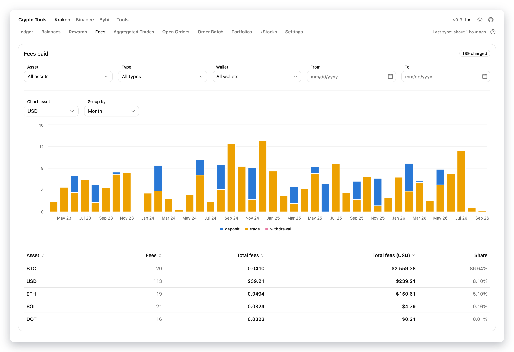
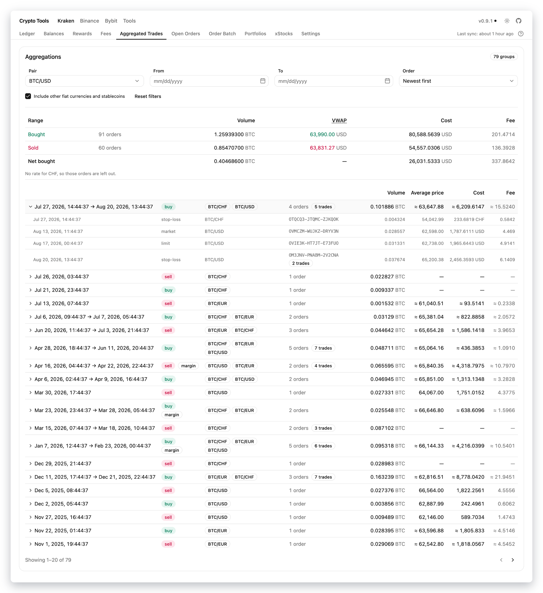
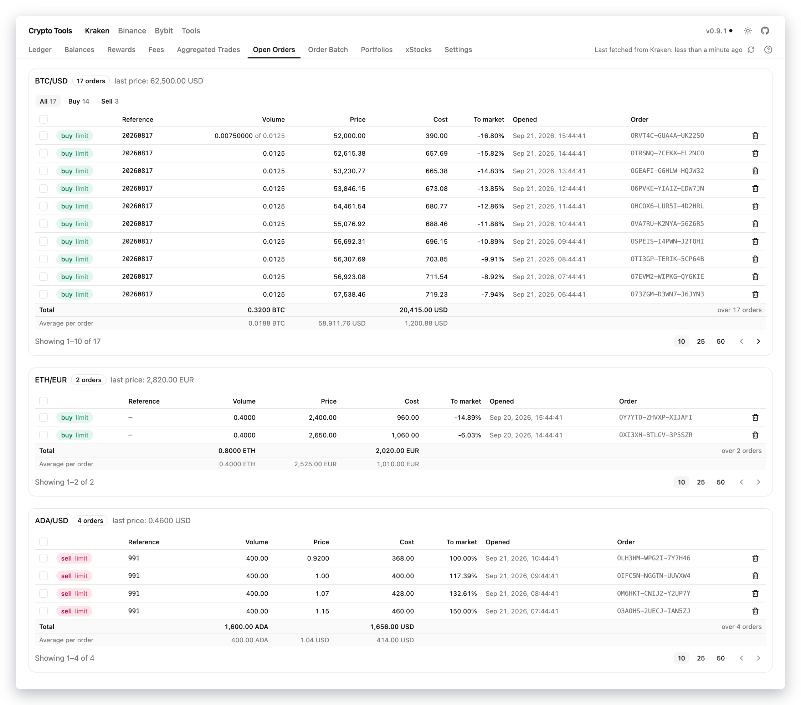

<h1 align="center">Crypto Tools</h1>

A collection of cryptocurrency tools for [Kraken](https://www.kraken.com/) and [Binance](https://www.binance.com/) exchanges. Built with Vite, React, React Router, Hono, Tailwind CSS and [shadcn/ui](https://ui.shadcn.com/); the desktop app is powered by [Electrobun](https://electrobun.dev/).


## Features

<details>
<summary><b>Kraken</b></summary>

<br>

**Ledger**



**Balances**



**Rewards**



**Fees**



**Aggregated Trades**



**Open Orders**



**Order Batch**


**xStocks**


</details>

<details>
<summary><b>Binance</b></summary>

<br>

**Staking**


</details>

## Install

Desktop apps for macOS (Apple Silicon) and Windows (x64). No admin rights needed.

**macOS — [Homebrew](https://brew.sh):**

```sh
brew install --cask nyg/tap/crypto-tools
```

**Windows — [Scoop](https://scoop.sh):**

```powershell
# run in PowerShell
scoop bucket add nyg https://github.com/nyg/scoop-bucket
scoop install git crypto-tools
```

If you don't have Scoop: `irm get.scoop.sh | iex`. It installs software in `C:\Users\<YOUR USERNAME>\scoop`.

### Without package managers

To install by hand instead, take the `.dmg` (macOS) or `.zip` (Windows) from the [latest release](https://github.com/nyg/crypto-tools/releases): drag **Crypto Tools.app** to **Applications**, or extract the ZIP and run **Crypto Tools-Setup.exe**.

### First launch

The app is ad-hoc signed on macOS and unsigned on Windows, so a manual install is blocked once — as *damaged* or *could not verify* on macOS, as *Windows protected your PC* on Windows. Neither means the app is broken or infected.

- **macOS**: `xattr -dr com.apple.quarantine "/Applications/Crypto Tools.app"`, then open it. (**System Settings → Privacy & Security → Open Anyway** works for the *could not verify* dialog only.)
- **Windows**: **More info → Run anyway**, which SmartScreen offers to administrators only. Standard users need the Scoop install.

## Run locally

Requires [Bun](https://bun.sh).

```sh
git clone https://github.com/nyg/crypto-tools.git
cd crypto-tools
bun install
bun run dev
```

The app is then on http://localhost:3000: `bun run dev` starts the Vite dev server (port 3000) and the Hono API server (port 3001), with `/api` proxied to the latter. API keys are set on the **Settings** page, the same as in the installed app.

### Other run commands

```sh
# run app with mocked data, no API key needed
bun run mocked

# launch the desktop app
bun run desktop:dev

# build a distributable into `artifacts/`
bun run build:stable
```

## Disclaimer

Use at your own risk.
