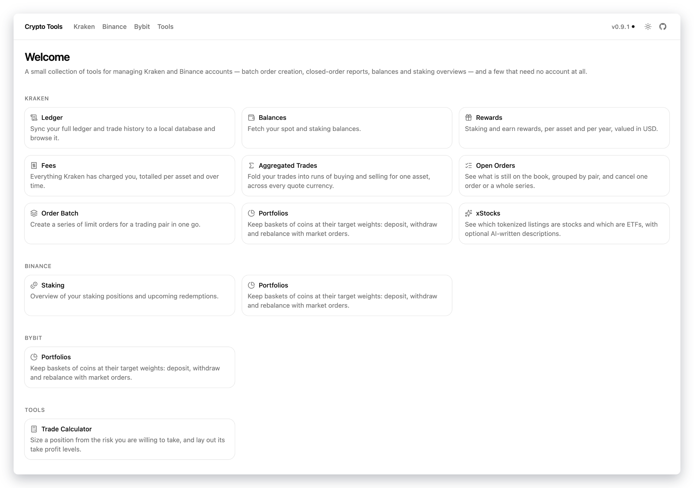
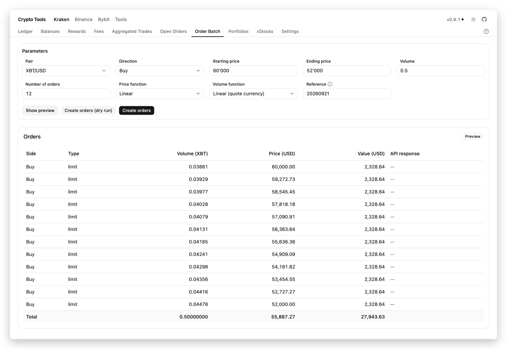
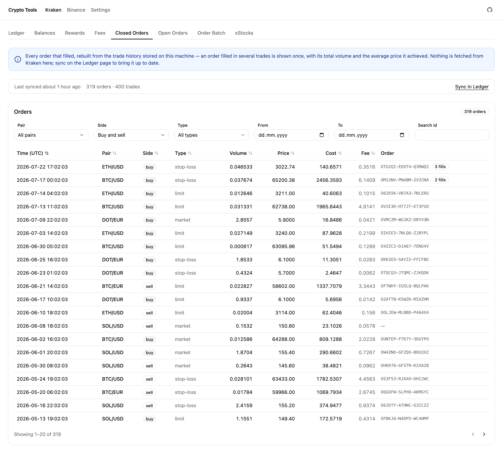
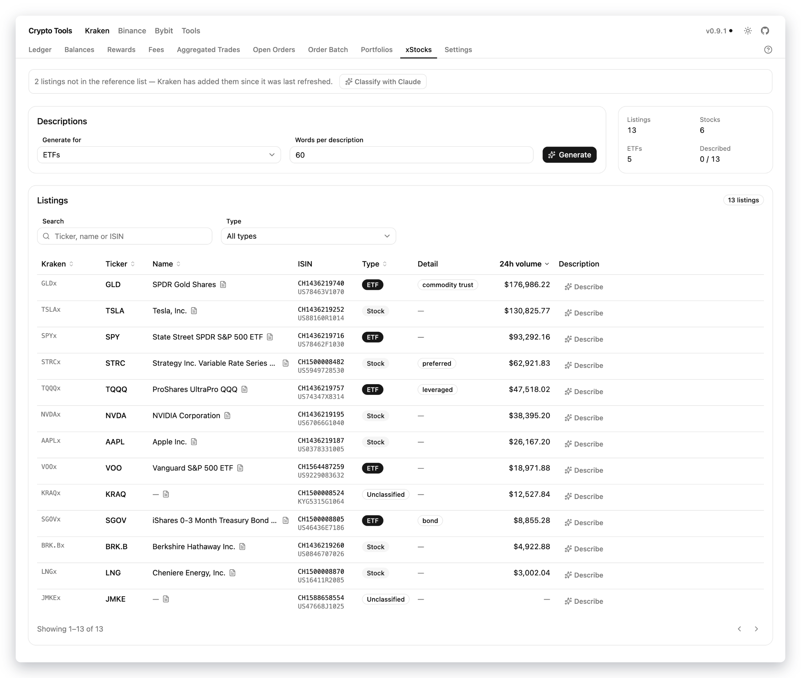
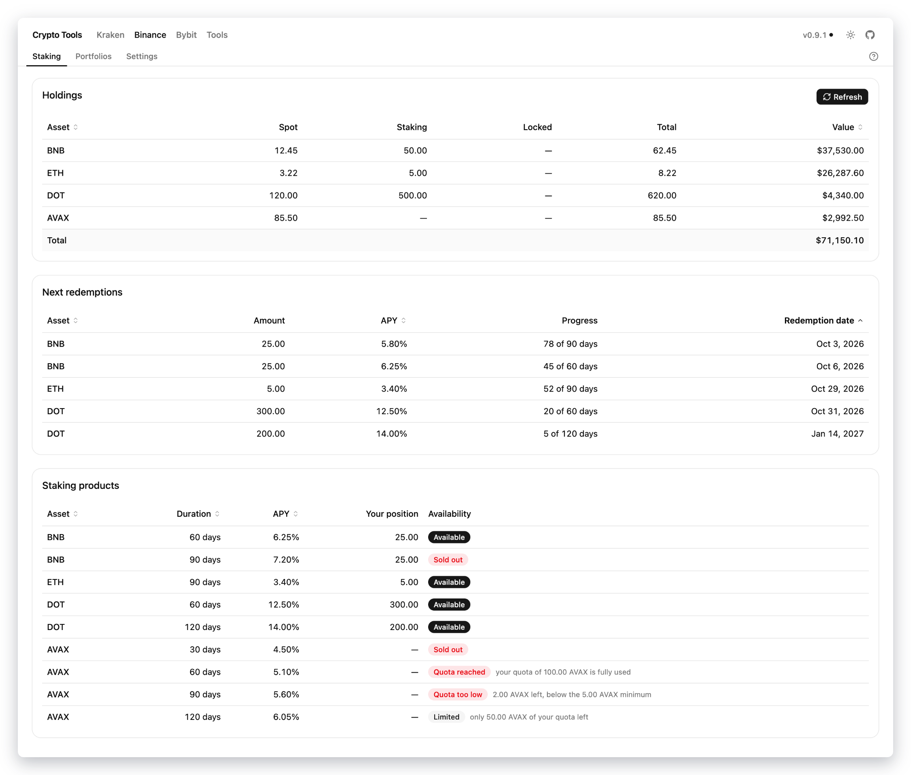

# Crypto Tools

A collection of cryptocurrency tools for [Kraken](https://www.kraken.com/) and [Binance](https://www.binance.com/) exchanges. Built with Vite, React, React Router, Hono, Tailwind CSS and [shadcn/ui](https://ui.shadcn.com/); the desktop app is powered by [Electrobun](https://electrobun.dev/).



## Features

### Kraken

- **Order Batch** — Create multiple buy or sell post-limit orders for a trading pair with configurable price and volume distribution functions. Supports dry-run mode for safe testing.
- **Closed Orders** — Browse every order that filled, read from the local database rather than the API. Orders are rebuilt from your stored trade history, so an order filled in several trades appears once with its total volume and the average price it achieved. Sortable and paginated, filterable by pair, side, order type, date range and order id.
- **Ledger** — Download your complete ledger (trades, deposits, withdrawals, staking and earn rewards) and your trade history through Kraken's export report endpoints and keep both in a local SQLite database, so other tools can use them without querying the API again. Syncs incrementally, and shows the stored date range, last sync time, entry and trade counts alongside a filterable table of entries.
- **Fees** — Dashboard of everything Kraken has charged since the account was opened — trade fees, withdrawal fees and anything else the ledger records — read from the local database. Totals per asset, a breakdown by ledger entry type, and a stacked chart over time by month, quarter or year. Fees are kept in the asset they were charged in and never converted between currencies.
- **Balances** — View spot and staking account balances.
- **xStocks** — which of Kraken's tokenized assets are stocks and which are ETFs, from a reference list shipped with the app, so it loads instantly and needs no API key. Anthropic Claude fills in listings Kraken has added since that list was refreshed, and writes descriptions on demand at a configurable word count; both are cached locally so they are billed once. Searchable and filterable by asset type.







### Binance

- **Staking Overview** — Overview of spot wallet balances and locked staking positions, including available and sold-out staking products for each asset. Shows next redemptions sorted by date, per-asset breakdowns with fiat valuations, and staking product details with quota analysis.



## Desktop App

Standalone desktop apps are available for macOS (Apple Silicon) and Windows — no Bun or Git required.

**macOS (recommended — Homebrew):**

```sh
brew install --cask nyg/tap/crypto-tools
```

This handles the Gatekeeper step for you (see below), so the app launches normally.

**Windows (recommended — Scoop):**

```powershell
scoop bucket add nyg https://github.com/nyg/scoop-bucket
scoop install crypto-tools
```

Scoop installs per-user (no admin rights) and avoids the SmartScreen prompt (see [Windows SmartScreen](#windows-smartscreen) below). If you don't have Scoop, install it first (no admin required):

```powershell
irm get.scoop.sh | iex
```

**macOS (manual) / Windows (manual):**

1. Download the installer from the [releases page](https://github.com/nyg/crypto-tools/releases):
   - macOS (Apple Silicon): `crypto-tools-<version>-macos-arm64.dmg`
   - Windows (x64): `crypto-tools-<version>-windows-x64-setup.zip`
2. **macOS**: open the DMG, drag **Crypto Tools.app** to your **Applications** folder, then see [macOS Gatekeeper](#macos-gatekeeper) below before first launch
3. **Windows**: extract the ZIP and run **Crypto Tools-Setup.exe** inside (installs per-user to `%LOCALAPPDATA%` — no admin rights). See [Windows SmartScreen](#windows-smartscreen) below before first launch.

API keys can be configured in the app on the **Settings** page (stored in `settings.json`, beside the ledger database in the app's data directory).

### macOS Gatekeeper

The app is **ad-hoc signed but not notarized** (it is not signed with a paid Apple Developer certificate). It is **not damaged or corrupted** — but because it is not notarized, macOS quarantines it after download and blocks the first launch. Depending on your macOS version and state, you may see either:

- *"Crypto Tools.app" is damaged and can't be opened. You should move it to the Trash.*, or
- *Apple could not verify "Crypto Tools.app" is free of malware…*

Both mean the same thing: macOS is blocking an un-notarized, quarantined app. The app is safe to open.

**Easiest fix — install via Homebrew** (`brew install --cask nyg/tap/crypto-tools`), which strips the quarantine flag automatically.

**If you downloaded the DMG manually**, remove the quarantine flag once after copying the app to Applications:

```sh
xattr -dr com.apple.quarantine "/Applications/Crypto Tools.app"
```

Then double-click to launch. This works for **both** dialogs above.

Alternatively, for the *"could not verify"* dialog only, you can use the GUI path: open **System Settings → Privacy & Security**, scroll to the security section, click **Open Anyway**, then confirm. (This option is not offered for the *"damaged"* dialog — use the `xattr` command above instead.)

You only need to do this once per installation.

> The only way to make the app launch with no prompt at all is Apple **notarization**, which requires a paid Apple Developer account and is intentionally not used here.

### Windows SmartScreen

The app is **not code-signed** (it is not signed with a paid Authenticode / EV certificate). It is **not a virus** — but because it is unsigned and has no SmartScreen reputation, Windows blocks the first launch with:

- *Windows protected your PC — Microsoft Defender SmartScreen prevented an unrecognised app from starting.*

**Easiest fix — install via Scoop** (see [Desktop App](#desktop-app) for the `scoop bucket add` + `scoop install` commands), which downloads and extracts the app itself. Files extracted by Scoop don't carry the "mark of the web", so SmartScreen never fires — this works for standard (non-admin) users too.

**If you downloaded the ZIP manually**, after extracting it, click **More info → Run anyway** on the SmartScreen dialog.

> **Note:** the *More info → Run anyway* option is only offered to **administrator** accounts. Standard (non-admin) users get a hard block with no bypass when running the manually-downloaded installer — for those users, **Scoop is the only no-admin install path** (short of paid Windows code signing, which is intentionally not used here).

The app installs per-user to `%LOCALAPPDATA%` and never requires admin rights.

### Building the desktop app

```sh
bun run build:stable   # produces artifacts/ with .dmg (macOS) or .zip (Windows)
```

To run the desktop app locally without building a distributable:

```sh
bun run desktop:dev
```

## Development

### Prerequisites

- [Bun](https://bun.sh/) — runtime and package manager

### Installation

1. Clone the repository
   ```sh
   git clone https://github.com/nyg/crypto-tools.git
   cd crypto-tools
   ```
2. Install dependencies
   ```sh
   bun install
   ```
3. (Optional) Copy `.env.development.local.example` to `.env.development.local` and fill in your API keys
4. Start the development server
   ```sh
   bun run dev
   ```
5. Open http://localhost:3000

`bun run dev` starts both the Vite dev server (port 3000) and the Hono API server (port 3001) concurrently. Vite proxies `/api` requests to the Hono server.

### Mocked Mode

Run the frontend only with mock data (no API keys or server required):

```sh
bun run mocked
```

This sets `VITE_MOCK_DATA=true`, which intercepts all API calls with a mock fetcher, including the settings endpoint, so every page behaves as if credentials were configured. Nothing is written to disk. Useful for development and demos.

## Usage

The home page links to every tool; the top menu bar switches between exchanges and each exchange section has sub-navigation for its specific features.

API keys for Kraken, Binance, and Anthropic can be configured on the **Settings** page or, in development, via environment variables (`KRAKEN_API_KEY`, `KRAKEN_API_SECRET`, and the `BINANCE_`/`ANTHROPIC_` equivalents; the older `VITE_`-prefixed names are still read). They are held by the local server rather than by the page, so they never enter browser storage and are never sent to anything but the exchange they belong to. An environment variable takes precedence over a saved key, and the Settings page says so when one is in effect.

Prefer a dedicated Kraken API key for this app. Kraken requires nonces to increase on every private call for a given key, so sharing one key between two applications making concurrent requests can make either of them fail with `EAPI:Invalid nonce`.

### Stored data

Everything the app keeps lives in the per-user application data directory — `~/Library/Application Support/Crypto Tools` on macOS, `%APPDATA%\Crypto Tools` on Windows, `$XDG_DATA_HOME/crypto-tools` on Linux. A directory left behind by a version older than v0.1.2 (named `CryptoTools`) is moved across on first launch. Set `CRYPTO_TOOLS_DATA_DIR` to override it.

- `ledger.db` — the SQLite database behind the Ledger, Balances, Rewards, Fees and Closed Orders pages. Deleting it (or using **Clear data**) simply means the next sync downloads everything again.
- `settings.json` — the API keys, written with owner-only permissions.
- `window-state.json` — the window's last position and size.

`bun run dev` writes to `ledger-dev.db` and `settings-dev.json` so it never touches the installed app's data. Nothing is uploaded anywhere.

The Kraken rows are partitioned by an account id derived once, from the first key you save, and then kept: rotating your Kraken API key leaves the synced ledger where it is. Rows left behind by a key rotation from before this was the case are listed at the bottom of the sync card.

The browser's `localStorage` is used only for view preferences — filters, sorting and the order-batch form. Nothing there is needed to reach an exchange, and clearing it loses nothing but those choices.

## Project Structure

```
src/
├── electrobun/         Electrobun main process (TypeScript)
├── server/             Hono API server (runs on Bun)
│   ├── adapters/       External API adapters (Binance, Kraken, Anthropic)
│   │   └── http-requester/  HTTP transport abstraction
│   ├── db/             SQLite storage for the Kraken ledger (bun:sqlite)
│   ├── routes/         Hono route handlers (binance.js, kraken.js, kraken-ledger.js)
│   └── services/       Business logic (rate finder, Kraken ledger sync)
├── utils/              Shared utility functions (crypto, formatting, event bus)
└── views/              React frontend (built by Vite)
    ├── components/     React components
    │   ├── binance/    Binance-specific components
    │   ├── kraken/     Kraken-specific components
    │   ├── lib/        Custom wrapper components (NumericInput, SubNav, etc.)
    │   └── ui/         shadcn/ui primitives
    ├── lib/            Frontend utilities (cn)
    ├── mocks/          Mock data generators for development
    ├── pages/          Page-level React components
    │   ├── binance/
    │   └── kraken/
    └── styles/         Global stylesheet and theme tokens
```

## Disclaimer

Use at your own risk.

## License

[MIT](LICENSE)
