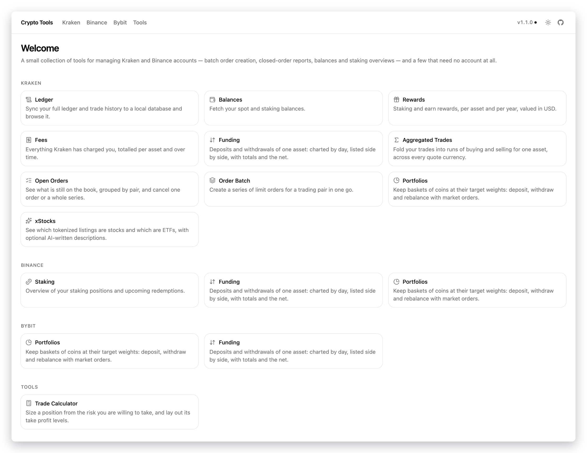
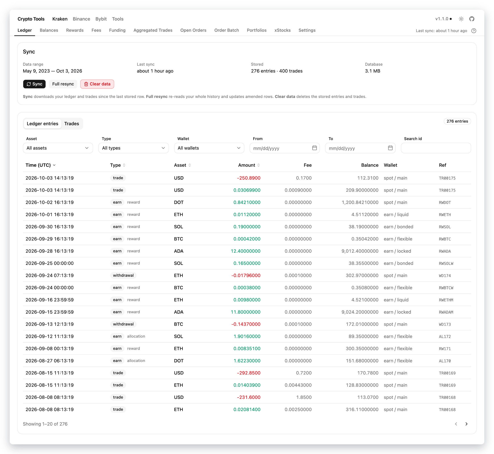
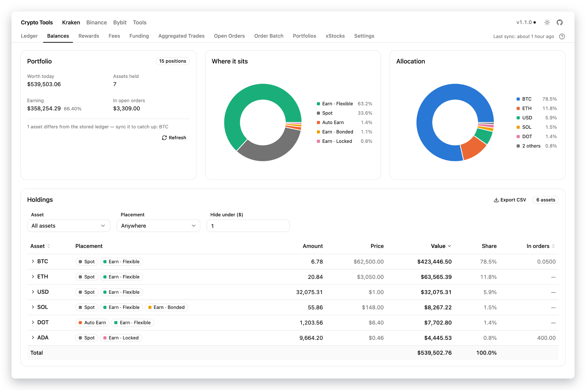
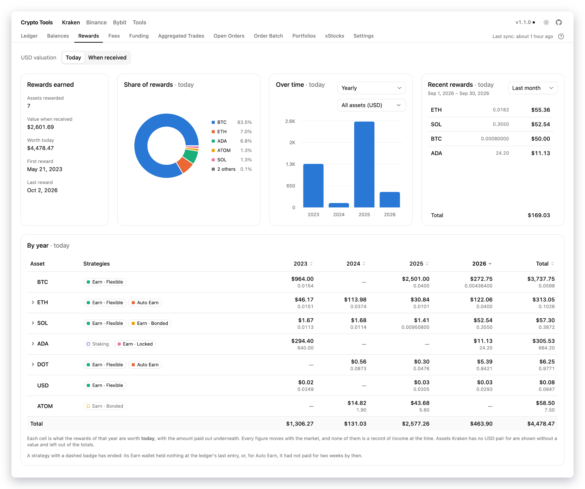
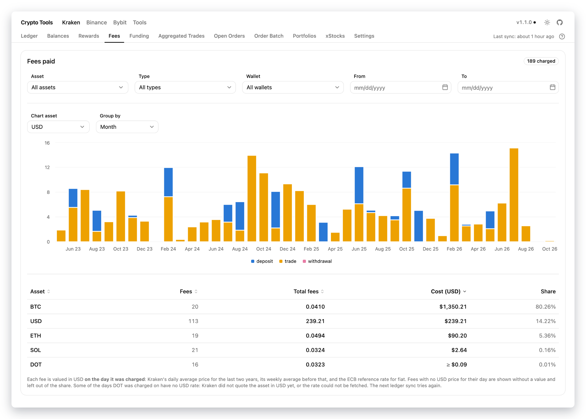
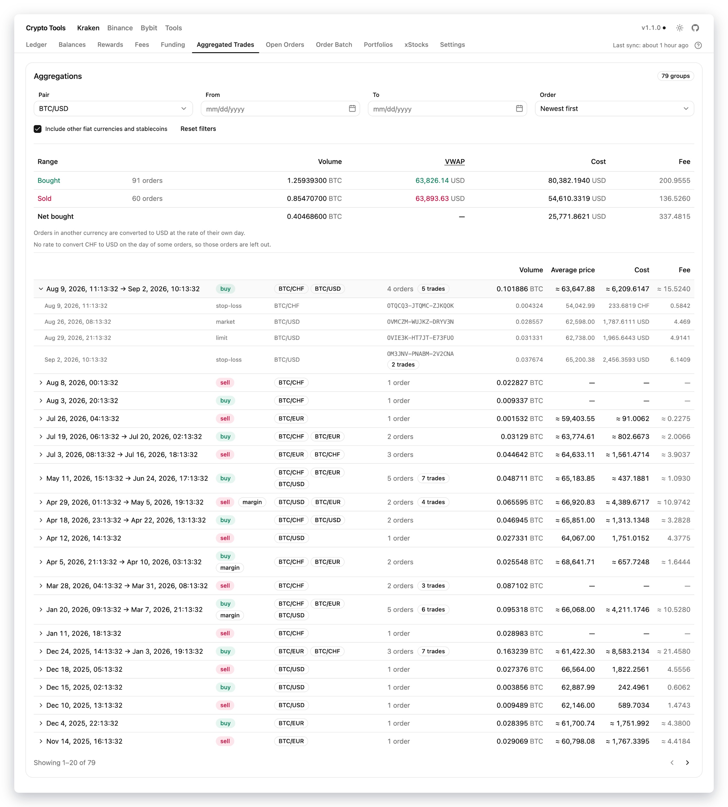
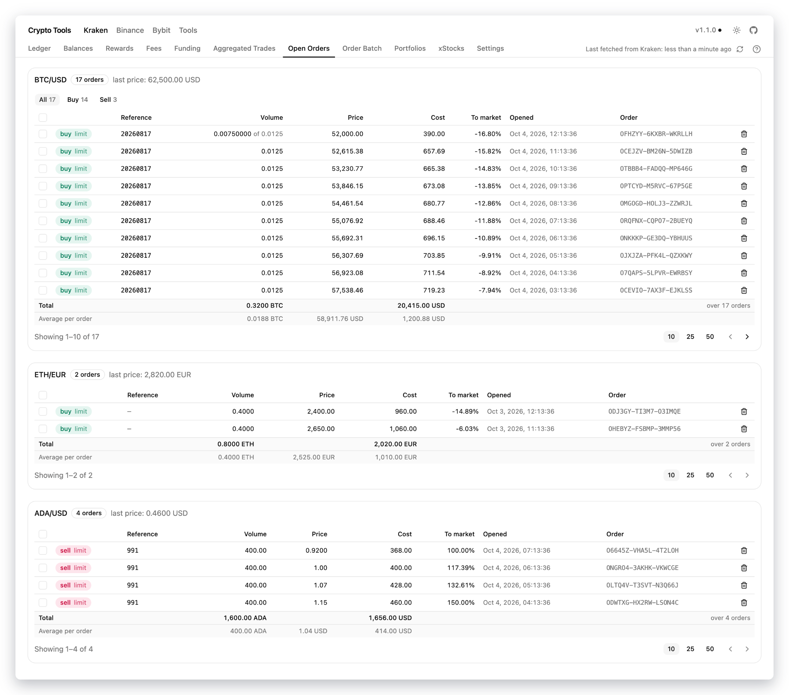
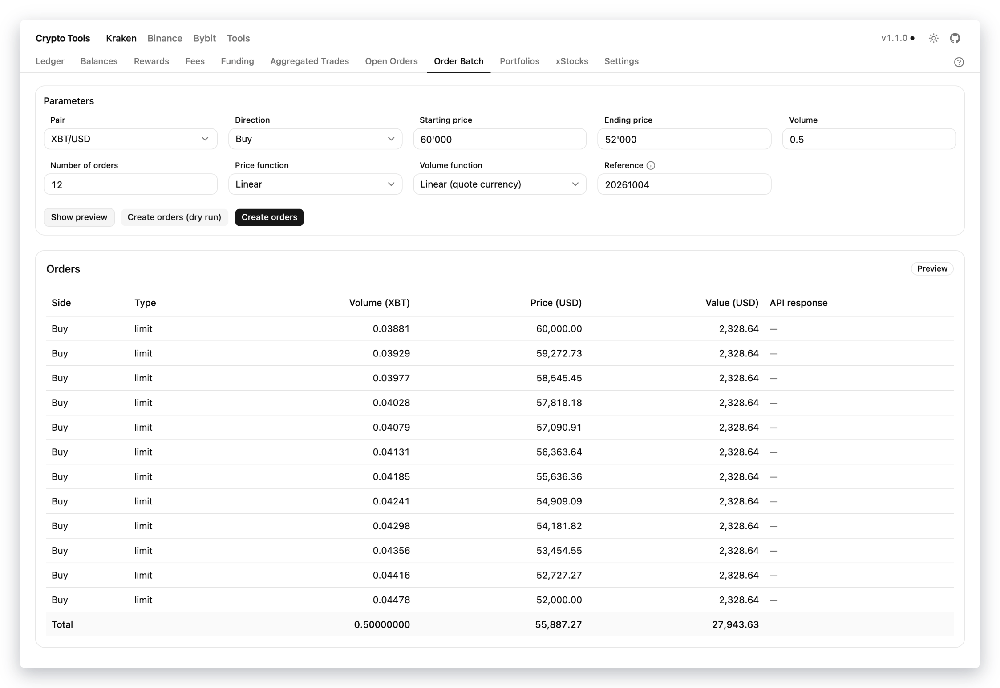
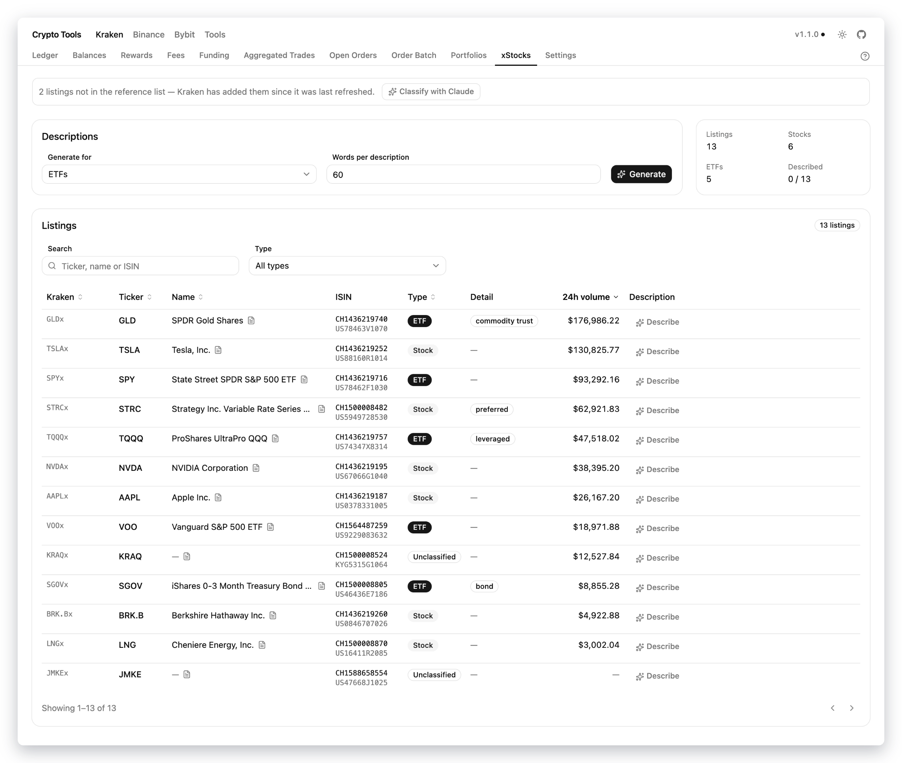
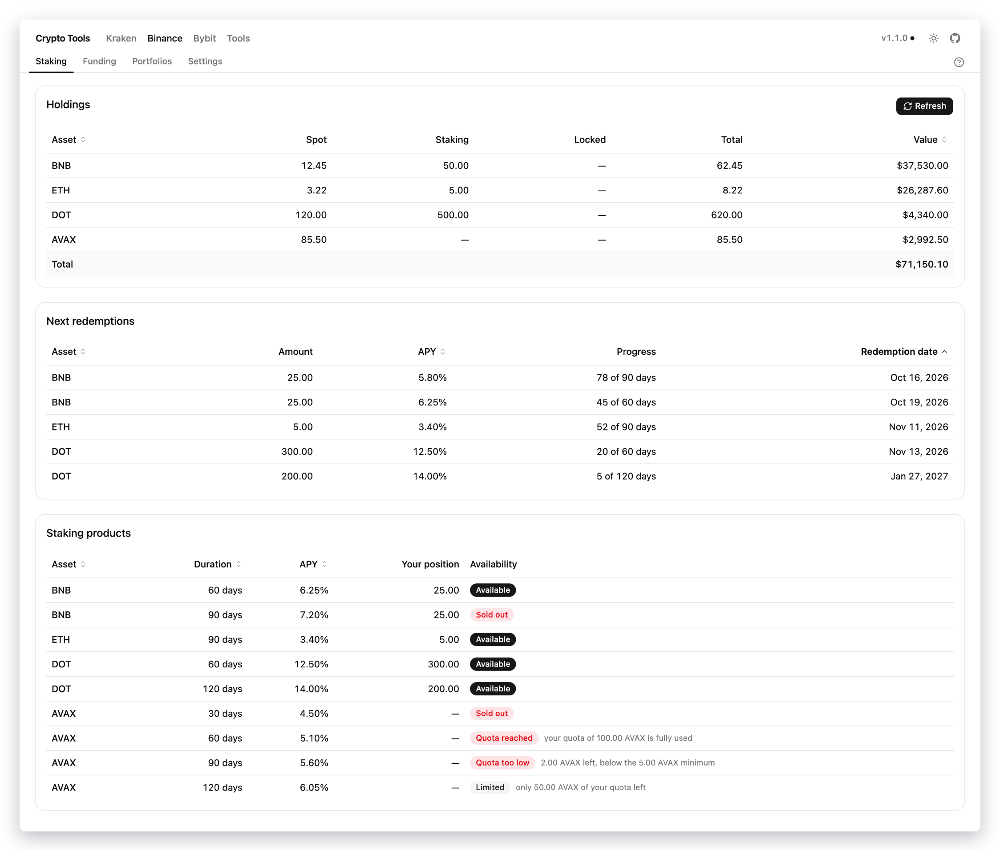

<h1 align="center">Crypto Tools</h1>

A collection of cryptocurrency tools for [Kraken](https://www.kraken.com/), [Binance](https://www.binance.com/) and [Bybit](https://www.bybit.com/) exchanges. Built with Vite, React, React Router, Hono, Tailwind CSS and [shadcn/ui](https://ui.shadcn.com/); the desktop app is powered by [Electrobun](https://electrobun.dev/).



## Features

<details>
<summary><b>Kraken</b></summary>

<br>

**Ledger**



**Balances**



**Rewards**



**Fees**



**Aggregated Trades**



**Open Orders**



**Order Batch**



**xStocks**



**Portfolios** — the same portfolios as on Bybit, in your Kraken spot wallet, with USD, EUR, USDT or USDC as the cash coin. Stops rest on Kraken as `stop-loss` orders. The API key needs Query Funds, Query Open Orders & Trades, Query Closed Orders & Trades, Create & Modify Orders and Cancel/Close Orders, and never Withdraw Funds.

</details>

<details>
<summary><b>Binance</b></summary>

<br>

**Staking**



**Portfolios** — the same portfolios as on Bybit, in your Binance spot wallet. Stops rest on Binance as `STOP_LOSS` orders. A Testnet switch runs it against the Binance spot testnet with its own keys and test funds. The API key needs Enable Reading and Enable Spot & Margin Trading, and never Enable Withdrawals. Turn off paying fees with BNB: a portfolio only holds its own coins, and a fee charged in BNB would show up in it as a negative BNB holding.

</details>

<details>
<summary><b>Bybit</b></summary>

<br>

**Portfolios** — define baskets of coins with target weights inside one Bybit unified trading account, deposit coins already on the account into them, and withdraw or rebalance with spot market orders. Every order is previewed first and only placed once you confirm; each portfolio's holdings are tracked on this machine from its own deposits and fills, so several portfolios can share one account and trades you make on Bybit yourself never touch them. Each target coin can also carry a stop price: the app rests a spot conditional order on Bybit for the portfolio's holding of that coin, keeps it the right size around every run, deposit and adjustment, and when it fires records the sell, drops the coin from the targets and moves its weight to cash so a rebalance does not buy it straight back. A Demo switch runs the same thing against Bybit's demo trading account. The API key needs the Read and Spot trade permissions, and never the Withdrawal one.

</details>

## Install

Desktop apps for macOS (Apple Silicon) and Windows (x64).

### Installing on macOS

**Manual**

Download [`crypto-tools-…-macos-arm64.dmg`](https://github.com/nyg/crypto-tools/releases/latest), open it and drag **Crypto Tools.app** into your **Applications** folder. The app is **not notarized**, so macOS quarantines it after download and blocks the first launch (you may see *"Apple could not verify…"* or *"Crypto Tools.app is damaged"*). To let it through, open **System Settings → Privacy & Security**, scroll to the bottom and click **Open Anyway** next to *"Crypto Tools.app" was blocked to protect your Mac*. Alternatively, remove the quarantine flag yourself using the terminal:

```sh
xattr -dr com.apple.quarantine "/Applications/Crypto Tools.app"
```

**[Homebrew](https://brew.sh)**

Homebrew is a package manager for macOS. It handles all of the above automatically.

To install it, open Terminal and run:

```sh
/bin/bash -c "$(curl -fsSL https://raw.githubusercontent.com/Homebrew/install/HEAD/install.sh)"
```

When it finishes, run the commands it prints under *Next steps* to add `brew` to your `PATH`. Then install the app with:

```sh
brew install --cask nyg/tap/crypto-tools
```

### Installing on Windows

**Manual**

Download [`crypto-tools-…-windows-x64-setup.exe`](https://github.com/nyg/crypto-tools/releases/latest) and run it. It installs to `%LOCALAPPDATA%`, i.e. `C:\Users\<you>\AppData\Local`. The app is not code-signed, so SmartScreen will show *"Windows protected your PC"* on first run — click **More info → Run anyway**. No admin rights are needed, but a company laptop's policy may still block the installer. If it does, use Scoop instead.

**[Scoop](https://scoop.sh)**

Scoop is a package manager for Windows, similar to Homebrew for macOS. Use this install method if your company policy restricts manual installs.

To install it, open PowerShell and run:

```powershell
Set-ExecutionPolicy -ExecutionPolicy RemoteSigned -Scope CurrentUser
Invoke-RestMethod -Uri https://get.scoop.sh | Invoke-Expression
```

Then install the app with:

```powershell
scoop install git
scoop bucket add nyg https://github.com/nyg/scoop-bucket
scoop install crypto-tools
```

## Run locally

Requires [Bun](https://bun.sh).

```sh
git clone https://github.com/nyg/crypto-tools.git
cd crypto-tools
bun install
bun run dev
```

`bun run dev` starts the Vite dev server and the Hono API server, with `/api` proxied to the latter. Each takes a free port, so several checkouts run side by side, and Vite prints the address to open. Set `VITE_PORT` or `PORT` to choose one yourself. API keys are set on each exchange's **Settings** tab, the same as in the installed app.

Keys are kept in your operating system's credential store — Keychain on macOS, Credential Manager on Windows, libsecret on Linux — and never leave the machine. Where that store is not reachable they fall back to a `0600` file in the app's data directory, and the Settings tab says which of the two holds each key. Keys saved by an earlier version are moved across the first time this one starts.

### Other run commands

```sh
# run app with mocked data, no API key needed
bun run mocked

# launch the desktop app
bun run desktop:dev

# build a distributable into `artifacts/`
bun run build:stable
```

The desktop app is built by [Hutch](https://hutch.blackboard.sh), Electrobun's toolchain. There is nothing extra to install: the `electrobun` package downloads and caches it on first use, and projects the main-process SDK into `.hutch/devkit`. Run `bun run desktop:prepare` once on a fresh checkout if your editor needs to resolve those imports before you have run a build.

## Disclaimer

Use at your own risk.
