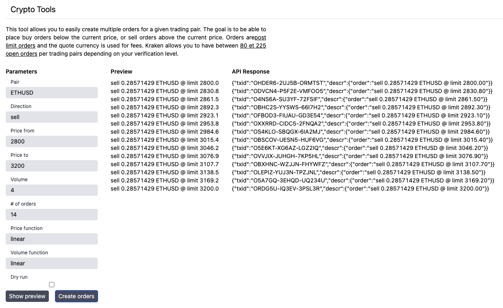
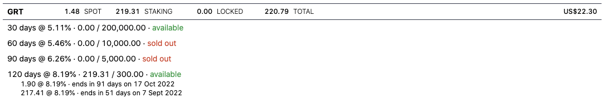

# Crypto Tools

## Kraken Order Batch

Allows you to easily create multiple buy or sell orders for a given trading
pair. Orders are [post limit orders](1) and the quote currency is used for fees.
Kraken allows you to have between [80 and 225 open orders](2) across all trading
pairs depending on your verification level.

## Binance Staking Overview

Provides an overview of your spot wallet balances as well as your locked staking
positions. It will also display the available or sold out locked staking
products for each of your assets.

## Getting Started

### Online

* https://crypto-tools.andstuff.dev

### Local Installation

1. Install Node.js & pnpm
1. Clone or download this repository
1. Create an API key in your Kraken/Binance account and copy paste the values in
   the Settings page
1. Using the terminal, run `pnpm install` and then `pnpm dev` inside the
   downloaded folder
1. Open [http://localhost:3000/](http://localhost:3000/)

## Disclaimer

Use at your own risk.
